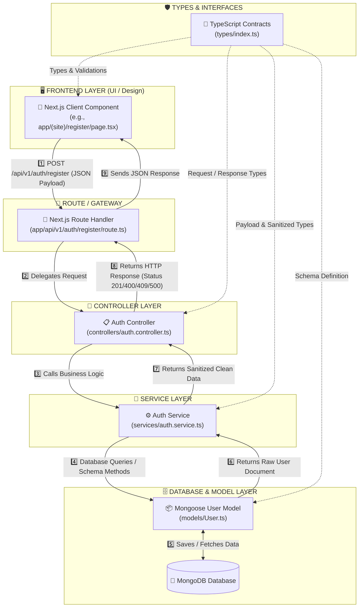

# 🚗 Car Doctor — Full-Stack Architecture & Development Guide

Welcome to the **Car Doctor** project! এই ডকুমেন্টটিতে আমাদের প্রজেক্টের পুরো **Architecture & Data Flow** (`UI/Design` ➔ `Route` ➔ `Controller` ➔ `Service` ➔ `Model` ➔ `Interface`) খুব সহজ ও প্রফেশনালভাবে বুঝিয়ে দেওয়া হলো, যাতে যে কেউ প্রজেক্টের কোড দেখলেই পুরো সিস্টেমটি এক নজরে বুঝে ফেলতে পারে।

---

## 🏗️ 1. Architecture Overview (The Big Picture)

আমরা এই প্রজেক্টে একটি **Clean & Layered Production-Grade Architecture (MVC + Service Layer)** ব্যবহার করেছি। প্রতিটি লেয়ারের নির্দিষ্ট কাজ রয়েছে (Separation of Concerns):



---

## 🏢 2. Restaurant Analogy (সহজ বাস্তব উদাহরণ)

সিস্টেমটি কিভাবে কাজ করে তা বুঝতে একটি **রেস্তোরাঁর উদাহরণ** দেখা যাক:

| Layer | রেস্তোরাঁর ভূমিকা | প্রজেক্টে এর ভূমিকা |
| :--- | :--- | :--- |
| **🎨 Design / UI** | 🍽️ **ডাইনিং টেবিল ও মেনু কার্ড** | ব্যবহারকারী ফর্ম দেখে ইনপুট দেন ও বাটন ক্লিক করেন |
| **🚦 Route (`route.ts`)** | 🚪 **রেস্তোরাঁর প্রবেশদ্বার / অভ্যর্থনা** | রিকোয়েস্টটি সঠিক ঠিকানায় এসেছে কিনা দেখে ভেতরে পাঠায় |
| **📋 Controller** | 🤵 **ওয়েটার (Waiter)** | রিকোয়েস্ট রিসিভ করে, ঠিক আছে কিনা যাচাই করে এবং শেফকে (Service) পাঠায়, পরে রান্না করা খাবার কাস্টমারকে ফেরত দেয় |
| **⚙️ Service** | 👨‍🍳 **প্রধান শেফ (Kitchen / Brain)** | রান্নার আসল লজিক (বিজনেস লজিক) চালায়, ডাটাবেজ থেকে জিনিস আনে ও বানায় |
| **📦 Model** | 🥫 **পেন্ট্রি / রেসিপি ব্লুপ্রিন্ট** | কোন জিনিসে কি থাকবে (Schema) এবং ডাটাবেজ স্টোরেজের গঠন নিশ্চিত করে |
| **📜 Interface / Types** | 🛡️ **খাবারের মান নিয়ন্ত্রণ বিধিমালা** | কোডিংয়ের টাইপ সেফটি ও স্পেসিফিকেশন ঠিক রাখে যাতে কোনো ভুল না হয় |

---

## 🔍 3. প্রতিটি Layer-এর বিস্তারিত কাজ ও ব্যাখ্যা

### 1️⃣ 📜 Interface / Types (`types/index.ts`)
* **কাজ কী?**: TypeScript ইন্টারফেস হলো কোডের **চুক্তি (Contract)**। 
* **কেন ব্যবহার করি?**: 
  - ডাটাবেজে ইউজারের কি কি ফিল্ড থাকবে (`name`, `email`, `role`, `password`) তা নির্ধারণ করে।
  - এপিআই রিকোয়েস্টে কি পাঠানো যাবে (`RegisterPayload`) এবং রেসপন্সে কি ফেরত আসবে (`ApiResponse<T>`) তা ফিক্স করে দেয়।
* **ফাইল অবস্থান**: `types/index.ts`

```typescript
export interface IUser {
  _id?: string;
  name: string;
  email: string;
  password?: string;
  role?: "user" | "admin";
  createdAt?: Date;
}
```

---

### 2️⃣ 📦 Model (`models/User.ts`)
* **কাজ কী?**: MongoDB-এর টেবিল (Collection)-এর স্ট্রাকচার বা ব্লুপ্রিন্ট তৈরি করা।
* **মূল কাজসমূহ**:
  - ডাটা ভ্যালিডেশন (যেমন: email অনন্য হতে হবে, password নূন্যতম ৬ অক্ষরের হতে হবে)।
  - **Mongoose Pre-Save Hook**: ডাটাবেজে ইউজার সেভ হওয়ার আগে স্বয়ংক্রিয়ভাবে পাসওয়ার্ড `bcrypt` দিয়ে হ্যাশ (Encrypt) করা।
  - Next.js Hot-reload-এ মডেল যাতে বারবার ডুপ্লিকেট না হয় (`mongoose.models.User || ...`) তা হ্যান্ডেল করা।
* **ফাইল অবস্থান**: `models/User.ts`

---

### 3️⃣ ⚙️ Service Layer (`services/auth.service.ts`)
* **কাজ কী?**: এটি অ্যাপ্লিকেশনের **Pure Business Logic** লেয়ার।
* **মূল কাজসমূহ**:
  - এই লেয়ার কোনো HTTP Request বা Response চেনে না (No `req`, `res`)।
  - ডাটাবেজে আগে থেকে একই ইমেইল রেজিস্টার্ড আছে কিনা চেক করা।
  - নতুন ইউজার তৈরি করে সিকিউরিটির জন্য পাসওয়ার্ড বাদ দিয়ে শুধু নিরাপদ ডাটা ফেরত পাঠানো।
  - সব ইউজার ফেচ করা (`getUsers()`)।
  - কোনো সমস্যা হলে কাস্টম `ServiceError` থ্রো করা।
* **ফাইল অবস্থান**: `services/auth.service.ts`

---

### 4️⃣ 📋 Controller Layer (`controllers/auth.controller.ts`)
* **কাজ কী?**: এটি HTTP ট্রাফিক কন্ট্রোলার।
* **মূল কাজসমূহ**:
  - ইনকামিং `Request` থেকে বডি পার্স করা (`request.json()`)।
  - ফিল্ডগুলো ফাঁকা কিনা প্রাথমিক ভ্যালিডেশন করা।
  - `AuthService`-কে কল করে ডাটা প্রসেস করা।
  - HTTP Status Code ঠিক করে রেসপন্স দেওয়া:
    - `201 Created`: সফল রেজিস্ট্রেশন
    - `400 Bad Request`: ডাটা মিসিং
    - `409 Conflict`: ইমেইল ডুপ্লিকেট
    - `500 Internal Server Error`: সার্ভার ত্রুটি
* **ফাইল অবস্থান**: `controllers/auth.controller.ts`

---

### 5️⃣ 🚦 Route Handler (`app/api/v1/auth/register/route.ts`)
* **কাজ কী?**: Next.js App Router-এর অফিশিয়াল API Entry Point।
* **মূল কাজসমূহ**:
  - পাতলা (Thin) এন্ট্রি পয়েন্ট হিসেবে কাজ করা।
  - শুধুমাত্র HTTP Methods (`POST`, `GET`) এক্সপোর্ট করে এবং সাথে সাথে কন্ট্রোলারের কাছে হ্যান্ডেল করার জন্য পাঠিয়ে দেয়।
* **ফাইল অবস্থান**: `app/api/v1/auth/register/route.ts`

```typescript
import AuthController from "@/controllers/auth.controller";

// POST /api/v1/auth/register
export async function POST(request: Request) {
  return AuthController.handleRegister(request);
}

// GET /api/v1/auth/register
export async function GET(request: Request) {
  return AuthController.handleGetRegister();
}
```

---

### 6️⃣ 🎨 Design & Frontend Integration (`app/(site)/register/page.tsx`)
* **কাজ কী?**: ইউজার ইন্টারফেস (UI) এবং ইউজার ইন্টারেকশন।
* **মূল কাজসমূহ**:
  - সুন্দর ও আধুনিক ফর্ম ডিজাইন।
  - ক্লায়েন্ট সাইড পাসওয়ার্ড ম্যাচ ও ভ্যালিডেশন চেক।
  - `fetch("/api/v1/auth/register", { method: "POST", ... })` দিয়ে ব্যাকএন্ড এপিআই কল করা।
  - লোডিং স্পিনার (Loading State) দেখানো।
  - সফল হলে গ্রিন সাকসেস মেসেজ দেখিয়ে `/login` পেজে রিডাইরেক্ট করা।
  - এরর হলে (যেমন ডুপ্লিকেট ইমেইল) লাল এরর বক্স দেখানো।

---

## 📊 4. Admin Dashboard Flow (`app/(dashboard)/...`)

আমাদের প্রজেক্টে একটি আধুনিক **Admin Dashboard** যুক্ত করা হয়েছে:

```
app/(dashboard)/
├── layout.tsx                ← আলাদা লেআউট (Sidebar + Dashboard Topbar)
└── dashboard/
    ├── page.tsx              ← Overview পেজ (Total Users, Services, Revenue কার্ডস)
    └── users/
        └── page.tsx          ← Users Management পেজ (এপিআই থেকে ইউজার লিস্ট নিয়ে টেবিল তৈরি)
```

* **Data Fetching**: `/dashboard/users` পেজে `GET /api/v1/auth/register` কল করে ডাটাবেজের সকল রেজিস্টার্ড ইউজারকে রিয়েল-টাইমে লাইভ টেবিলে দেখানো হয়।
* **UI Features**: সার্চ ফিল্টার, রিফ্রেশ বাটন, সুন্দর অ্যাভাটার গ্রেডিয়েন্ট এবং স্কেলিটন লোডার (Skeleton Loading)।

---

## 🚀 5. Getting Started & Running Locally

### ১. ডিপেন্ডেন্সি ইনস্টল করুন:
```bash
npm install
```

### ২. এনভায়রনমেন্ট ভ্যারিয়েবল সেট করুন (`.env.local`):
```env
MONGODB_URI=mongodb+srv://<username>:<password>@cluster0.example.mongodb.net/carDoctor?retryWrites=true&w=majority&appName=Cluster0
```

### ৩. ডেভেলপমেন্ট সার্ভার চালু করুন:
```bash
npm run dev
```

### ৪. গুরুত্বপূর্ণ লিঙ্কসমূহ:
- **Home Page**: [http://localhost:3000](http://localhost:3000)
- **Register Page**: [http://localhost:3000/register](http://localhost:3000/register)
- **Admin Dashboard Overview**: [http://localhost:3000/dashboard](http://localhost:3000/dashboard)
- **Admin Dashboard Users**: [http://localhost:3000/dashboard/users](http://localhost:3000/dashboard/users)
- **API Health Check**: [http://localhost:3000/api/v1](http://localhost:3000/api/v1)

---

💡 *Made with ❤️ for Car Doctor Engineering Team*
